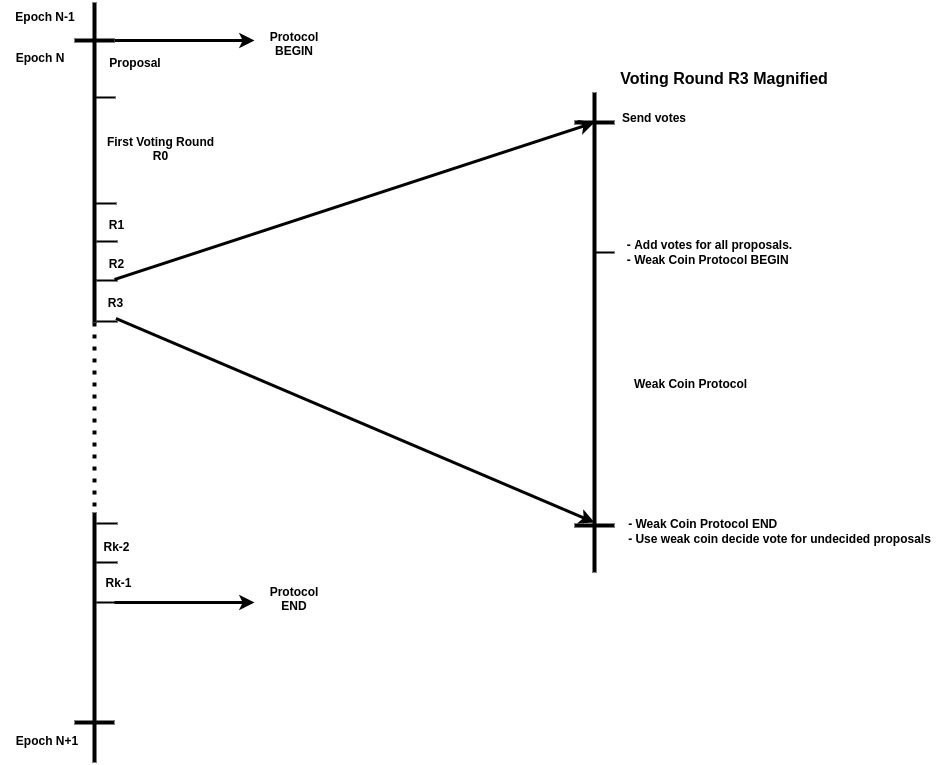

# Beacon

## Protocol

### Security Parameters

In the spacemesh whitepaper, we prove that our security guarantees hold with all but negligible probability 2-40 as long as the adversary controls less than a 1/3 fraction of spacetime resources in the system, and under reasonable network synchrony assumptions. Specifically, we assume that every message seen by an honest party at time _t_ will be seen by all honest parties at time _t+δ_, where time is measured in “rounds”; for concreteness, one can think of δ as 30 seconds, but the exact number depends on empirically measured network latency.

### Participants

All online smeshers participate in the beacon protocol. There are three phases in the protocol:

1. Proposal Phase: each sampled smesher submits a proposal for a random seed to be included in the beacon
2. Consensus Phase: smeshers run a consensus protocol to agree on which proposals are valid (i.e., will be included in the beacon).
3. Output: the valid proposals are combined to produce the final beacon value.

### Proposal Phase

The beacon protocol uses the smesher’s VRF keys to

* sample a subset of ATXs whose proposals are eligible. We need very few—only enough to ensure that there is at least one honest proposal included.
* compute the proposal itself.

#### Sampling Proposers

A proposal is a smesher’s VRF output of the epoch number. A proposal is eligible when it passes a difficulty threshold. This difficulty threshold is calculated such that the probability that no honest smesher is included is less than the Spacemesh security parameter 2-40. Assuming 1/3 malicious parties, the number of smeshers chosen is less than 100 with high probability.

#### The Proposal

Theoretically any arbitrary string can be used as a proposal, since honest parties will use a random string, and at least one will be included. But for extra security, the protocol uses the sampling VRF output itself.

### Consensus Phase

In the consensus phase, smeshers are not sampled. All smeshers vote repeatedly for a fixed number of rounds. The vote counting on the proposals is similar to the core Tortoise protocol and also employs a weak coin to allow votes to swing in the same direction when smeshers are undecided about a proposal in each round.

#### Initial Input

Each smesher partitions the proposals received into three sets:

* Valid:

  Proposals that satisfy both conditions below are considered valid.

  * The proposer’s ATX was received before the end of the previous epoch
  * The proposal is received before the proposal phase ends.

* Potentially Valid:

  Proposals that are not valid, but meet the following conditions are considered potentially valid.

  * The proposer’s ATX was received within _δ_ after the end of the previous epoch.
  * The proposal is received within _δ_ after the proposal phase ends.

  _δ_ is the network synchrony assumption of communication delay and is used as a grace period.

* Invalid:

  Proposals that are neither valid nor potentially valid are invalid.

Note that honest users cannot disagree on timing by more than δ. So if a proposal is valid for any honest user, it cannot be invalid for any other honest user (and vice versa).

A party’s initial input to the consensus algorithm is the set of valid proposals. To reach consensus, parties execute the core tortoise algorithm for the set of proposals, treating this set as a “layer” and each proposal as a “block”.

#### First Voting Round

In the first round, every party sends a vote for all valid proposals. The vote itself is a single message consisting of all the IDs it wants to vote for. It also includes a list of IDs that submitted the potentially valid proposals (it votes against those initially, but might change its vote later). An honest party always votes against invalid proposals by not including them in the first round votes at all.

#### Subsequent Voting Round

In every subsequent round, every party does the following:

* Count the votes from all previous rounds for every valid and potentially valid proposal. Only votes received before the weak coin protocol in round _i_ are counted in round _i_. Votes that are received after the weak coin protocol in round _i_ are counted in round _i+1_. Each vote is weighted according to the weight of the ID that sent it.
* If the sum of votes for a proposal is greater than a local threshold _θL_, it votes for it. If the sum is less than _-θL_, it votes against it. Otherwise, it waits for the weak coin protocol to finish and subsequently votes according to the weak coin on those proposals that didn’t cross the local threshold.
* Since each party votes for a subset of the proposals sent in the first round (parties never vote for invalid proposals), subsequent round votes can be encoded as a bit-string relative to identities sent in the first round. For our choice of parameters, the probability that more than 100 identities will be chosen is less than 2-40, so we can assume each vote consists of 100 bits.

#### Termination

The protocol continues for _r_ rounds. At the last round, each party selects the proposals according to the majority votes (regardless of the local threshold). _r_ is determined to ensure that the probability of any proposal not being in consensus is less than the Spacemesh security parameter 2-40.

#### Weak Coin

The weak coin protocol runs once per voting round except for the first one. The beacon weak coin is used to cause all honest parties to vote in the same direction for proposals that didn’t cross the local threshold (+/-)_θL_. As such, we need the smeshers to cast their vote on proposals before the weak coin is revealed in each round.

For the weak coin protocol in round _i_ where _i_ >= 1, the weak coin proposal is the smesher’s VRF output of the round number _i_. Each party waits δ, then takes the minimum valid VRF output received before that time. The LSB of the value is used as the coin value.

To reduce communication, we optimize this by having parties send their coin VRF only if it is below a threshold. Since at least one honest party will be below this threshold with high probability, any party that has a value above the threshold is guaranteed not to be chosen.

#### Timeline

##### Proposal phase

In the proposal phase, there are &lt;100 VRFs output. The duration is artificially kept short to help mitigate grinding.

##### Consensus phase

The first round of the consensus phase is by far the most expensive: every online smesher needs to send a list of &lt;100 proposals and a signature.

Each subsequent round has a tortoise phase followed by a weak-coin phase. In the tortoise phase, each party needs to send a 100 bit string and a signature. In the weak coin phase, &lt;100 parties each send a VRF output.

## Beacon Sync

All online smeshers participate in the beacon protocol in real time and calculate the beacon themselves. A smesher that just wakes up and comes online needs to sync data from its peers until it has all the data in the network before it can generate proposals and participate in the Hare protocol.

Specifically when a smesher rejoins the network at epoch _N_ and is eligible for creating proposals in epoch _N_, it doesn’t have the beacon for epoch _N_ because it didn’t participate in the beacon protocol in epoch _N-1_. The smesher has two options:

* Fetch from peers.

    This approach is faster but riskier. Using the wrong beacon value will render the smesher ineligible for making proposals and for participating in the Hare protocol for the entire epoch. If any of the peers is malicious, it will receive different beacons from different peers without indication of weight supporting each beacon value. It then has to fall back on the next option.

* Sample enough ballots in the network to determine the most-weighted beacon.

    In this case the smesher waits until it has fetched at least one cluster of ballots (800) and uses the beacon that has the most weight. There is a slight delay with this approach. But since the smesher cannot change its beacon value mid-epoch, this approach is safer because the smesher node knows the amount of ATX weight behind each beacon.

    If, in epoch _N_, the 800th ballot falls in the 3rd layer of the epoch, the smesher can only participate in the Hare protocol starting from the 4th layer. And it can only build proposals starting from the 4th layer, even if it’s eligible for earlier layers in epoch _N_.

Since we, in any case, need the fallback, only the second option is implemented in Spacemesh for synchronizing beacon values. When a ballot is received via gossip or a direct data request to peers, the ballot data handler reports the beacon value as the ballots come in. The beacon value will be determined as soon as the 800th valid ballot is received.

## Bootstrapping

At genesis, the network has no ATXs. Therefore no smeshers are eligible to participate in the beacon protocol. We need to bootstrap the beacon for the initial epochs.

### Epoch 0

In epoch 0, the network will be generating PoET proof for ATXs. Since there are no ATXs yet, the network cannot run the beacon protocol. However, the network doesn’t need a beacon because no proposals are generated and the Hare protocol does not run.

### Epoch 1

In epoch 1, smeshers publish their ATXs up to the end of the epoch. The ATXs they published make them eligible for proposals in epoch 2. Like epoch 1, the network cannot run the beacon protocol, but also doesn’t need a beacon.

### Epoch 2

In epoch 2, smeshers that published ATXs in epoch 1 are eligible to build proposals. This is the first epoch where we need a beacon. Even though the network can run the beacon protocol with smeshers that published ATXs in epoch 1, the beacon it generates is targeted for epoch 3. We need to bootstrap the beacon value for epoch 2.

Since the network is at its infancy at epoch 2, the adversary has very little to gain from attacking it. Spacemesh uses a constant string set at genesis for the beacon in epoch 2.

### Epochs ≥ 3

From epoch 3 and on, the network will use the beacon value generated by the beacon protocol in the previous epoch.
