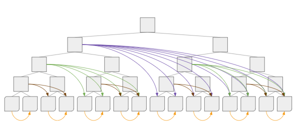

# Mining - Proof of Elapsed Time

Proof of Elapsed Time, or PoET, is a cryptographic primitive used to prove that a specific amount of real (clock) time has elapsed. Elapsed time is measured by iterating a sequential work cycle that takes a set amount of time to execute. The algorithm provides a proof that it has worked sequentially for a predetermined number of cycles, and thus proves that the period of time determined by its parameters has elapsed during its entire execution. By committing to knowledge of some information (known as a "statement") as input to the proof-generation algorithm, a prover can assert cryptographically that they had knowledge of that information as of a given point in time.

In the context of Spacemesh, PoET is used to introduce the concept of _time_ to the eligibility proofs submitted by miners by measuring the time interval between two executions of the [PoST algorithm](02-post.md). In effect, PoET allows a miner to assert not only that they previously generated a set of data (the initialization phase of PoST), but that they still have access to that data after some time has elapsed (the execution phase)—hence, proofs of _space-time._

A naive cryptographic approach to proving elapsed time is proof of work, i.e., using computational effort spent as a proxy for elapsed time. But while proof of work attests to a certain amount of computational work having been performed, it does not strictly correspond to elapsed clock time, since the work may be parallelized. Thus in order to prove elapsed time we must use a construction that requires _inherently sequential work_, i.e., where each unit of work depends upon the output of the previous unit, so that parallelization could not reduce the duration taken to complete the work (while still being bound to a single-core CPU speed, which can vary, but has a practical limit). This sort of construction is sometimes referred to as Proof of Sequential Work (PoSW), which can be used as a proxy for Proof of Elapsed Time (PoET).

The underlying idea is that it’s extremely hard to make the computation of an iterated sequence of hashes faster then the fastest consumer-grade CPU, in particular if we use a hash function (such as SHA256) that mainstream CPU makers have already spent considerable resources accelerating. This is in sharp contrast to increasing _total work throughput_ (i.e., the sort of work required by most computationally intensive applications), which can be done by parallelizing the work.

PoSW was first introduced in a 2013 paper by Mohammad Mahmoody, Tal Moran and Salil P. Vadhan ([MMV13](https://eprint.iacr.org/2011/553)). It is a protocol for proving that one performed _sequential_ computational work related to some statement, such that a minimum amount of time has passed since that statement became known to the actor performing the work (with a proof that’s publicly and efficiently verifiable). The initial motivation for such proofs was not blockchain designs but rather applications including document timestamping and universally verifiable CPU benchmarks. The construction of MMV13 is based on “depth-robust” graphs, which are designed to be memory hard (i.e., requiring not only a large amount of time but also a large amount of space to create a proof), making it impractical to use in a production blockchain.

A much simpler and more efficient construction was introduced in 2018 by Bram Cohen and Krzysztof Pietrzak ([CP18](https://eprint.iacr.org/2018/183)), winning the best paper award in Eurocrypt that year. It replaces the MMV13 depth-robust graph with a graph based on a Merkle tree. The Spacemesh protocol uses an open source [implementation](https://github.com/spacemeshos/poet) of the CP18 spec.

## Construction

Unlike the PoST construction, PoET construction occurs in a single phase. At the very highest level of abstraction, it involves the first party, the prover, running an arbitrary, agreed-upon piece of information (known as the “statement”) through an agreed-upon hash function for an agreed-upon period of time (_t,_ which in practice specfies the depth of the graph that's generated, where a larger graph results in more repetitions of the hash function, as a proxy for elapsed wall time). The prover then generates a proof based on the results and publishes it for anyone to independently verify. As with PoST, and as described further in [CP18](https://eprint.iacr.org/2018/183), PoET is made non-interactive, enabling independent verification of the proof, via the use of Fiat-Shamir. Read on to better understand the protocol.

### Non-interactive protocol

1. All parties, including anyone who will independently verify generated proofs, agree on set of shared parameters, including the designated period of time, _t_ (i.e., the depth of the graph), and the number of leaves to be included in a proof
2. Prover receives a statement, then using the statement as input runs the hash function for _t_ time, i.e., generates a graph of a specified depth, calculates a commitment to that graph (Merkle root), derives the challenge from the commitment (using the [Fiat-Shamir heuristic](https://en.wikipedia.org/wiki/Fiat%E2%80%93Shamir_heuristic)), generates a proof (a set of labels and Merkle paths corresponding to the derived challenge). Publishes statement, Merkle root, and proof.
3. Verifier independently derives the challenge from the Merkle root (using the Fiat-Shamir heuristic), verifies the proof. If accepted, verifier is convinced that _t_ time has passed since statement was learned by the prover. (See the next section for more information on how this happens.)

### Further details

The algorithm described above still leaves out some important details for the sake of readability and clarity, including the details of how verification works, as well as further details about how the graph is constructed in a _sequential_ fashion.

#### Verification

The verifier first uses Fiat-Shamir to derive the deterministic challenge based on the Merkle root that the prover committed to (as in PoST), i.e., a random set of leaf indices. She then verifies that the proof contains the correct number of Merkle paths and that the set of Merkle paths matches the committed-to Merkle root. Finally, she independently runs the hash function to recompute the labels for the chosen leaves to make sure that they match the values contained in the proof.

#### Sequential graph construction

In order to construct the graph (a directed acyclic graph, or DAG), the label of each leaf node is the hash of the concatenation of the list of its left siblings on the path to the root node (this is what makes the work _sequential_), salted with the statement (this is how the prover proves knowledge of the statement before beginning the algorithm). The label of each intermediate node is the hash of the concatenation of its children (left and then right), salted with the statement. For more details on the algorithm, see the [CP18](https://eprint.iacr.org/2018/183) paper and the open source [implementation](https://github.com/spacemeshos/poet).

Construction of the DAG

## PoET Service

Miners are not expected to perform the sequential work themselves, as this would contradict one of the main goals of the Spacemesh protocol, energy efficiency, since it would require continuous CPU work.

The trick is that _a single PoET instance can be shared among an arbitrary number of miners,_ so the amortized CPU cost drops as the number of miners utilizing a given PoET service grows. Since what’s needed is merely a proof that a certain amount of time has elapsed, proving that _someone_ did sequential work is sufficient: the work does not have to have been performed by the miner itself!

In Spacemesh, a single PoET service is sufficient to provide a proof on behalf of many miners. Each of these miners can independently, efficiently verify the correctness of the output of the service.

A miner registers with a public PoET service by submitting their input (a hash of a challenge constructed using their previous [ATX](05-atx.md), which contains their previous PoST) during the window advertised by the service. The service then creates a graph based on a Merkle tree whose leaves are the aggregate inputs from each miner, uses the root of the tree as the input (statement), runs the PoSW algorithm, and outputs a single, shared PoET proof that can be used by any of the registered miners.

In addition to the non-interactive proof whose input is the Merkle root of this graph created on the aggregate input (the “statement,” in the [algorithm laid out above](#algorithm)), the PoET service can also provide Merkle paths from specific leaves (i.e., specific miner inputs) to that Merkle root. This allows individual miners to verify to themselves, and prove to others, that their input was included.

However, in Spacemesh, since many miners in practice share a single proof, it would be reundant for them each to publish an individual Merkle proof (i.e., it would be a waste of mesh storage space). There is another, more efficient way of establishing that every miner input is an element of the Merkle root (statement), and so validated by the shared proof: the PoET service itself broadcasts the _ordered list of all miner inputs_ to the Spacemesh network via a Spacemesh-compatible gateway node (i.e., a node running a Spacemesh full node). Any verifier can then independently verify that each miner's proof is valid, i.e., that its input was included in a given PoET run.

## Chaining PoST and PoET

The last section, [Proof of Space-time](02-post.md), explained how a prover can assert in a deterministic, independently verifiable, non-interactive fashion that they generated and still have access to a particular dataset derived from a known seed, based on their unique ID. This section explains how a prover can assert, in the same fashion, that a specific amount of objective time (measured using repetitions of an agreed-upon algorithm as a proxy for time) has passed since they had knowledge of a statement. The next section, [Non-interactive Proof of Space-time](04-nipst.md), ties these two ideas together and explains how PoST and PoET proofs can be chained to assert _ongoing_ commitment to the dataset for an arbitrarily long period of time.

